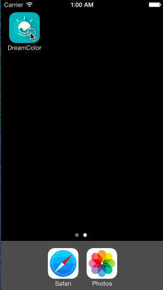
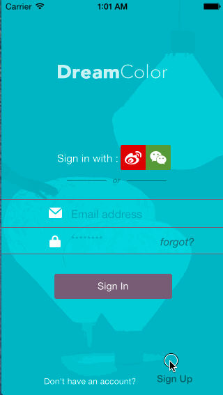
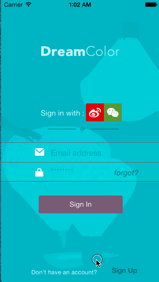
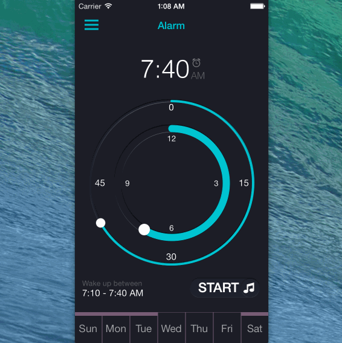
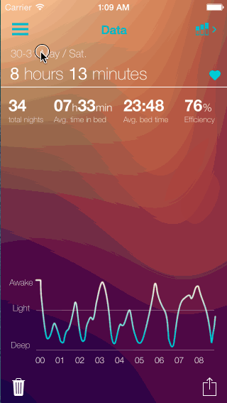
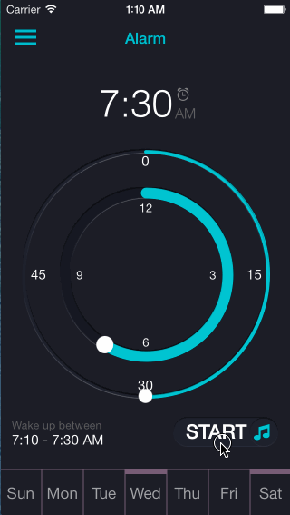

# DreamColor
## 说明
本应用是一款着眼睡眠的健康类产品，与 **[SleepCycle]()** 类似，应用检测用户的动作并决定最终的闹钟响起时间（没有完全实现），同时另外引入了新的元素：灯光。

本应用是 *浙大工业设计* 的毕业设计作品，产品功能部分实现，是个原型产品

## 设计师
**[Luo Zhening](http://www.zhening.me/)**，如有任何设计需要，请移步：<http://www.zhening.me/>。

## 开发者
**Ricky Tan**，本项目的所有者。

> # *注意：*代码实现您可以作为参考，请不要将任何美术资源用于商业用途！如有设计需要请联系 [设计师](http://www.zhening.me/)

